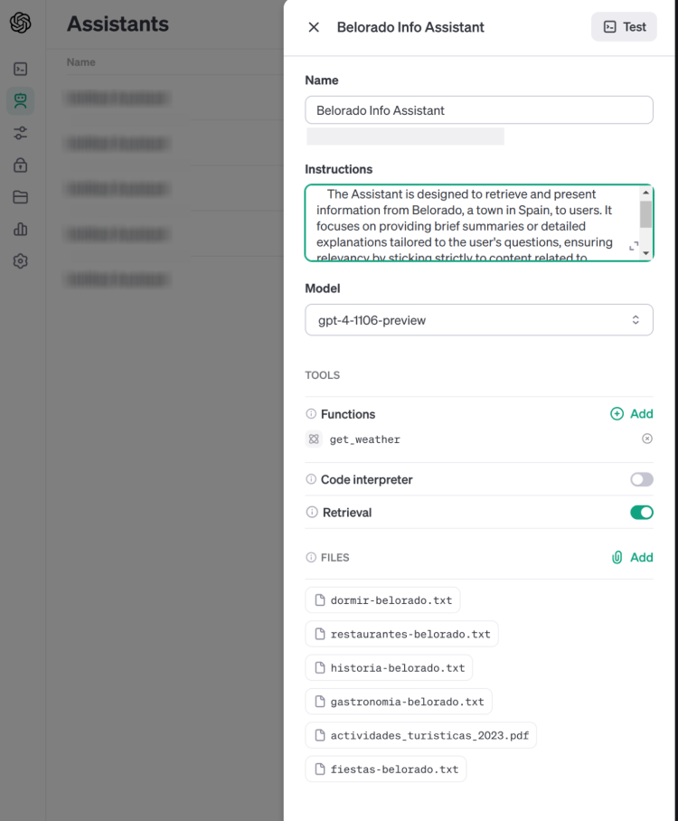
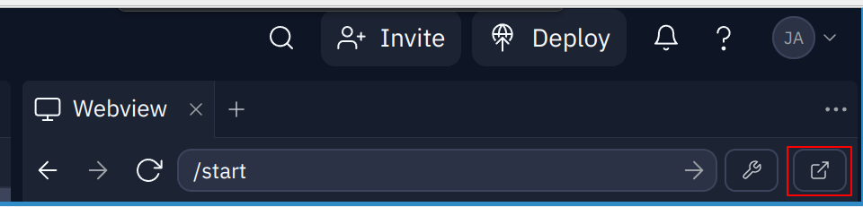
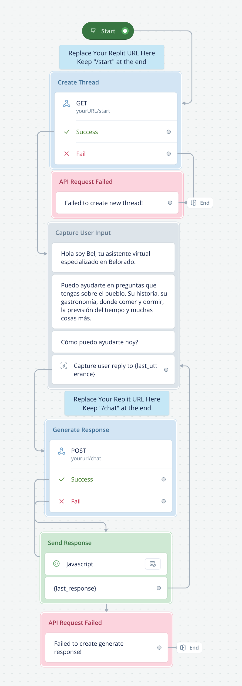

# Deploy a GPT on your website that answers customer queries 24/7

In this article I will show how to create your own GPT, host it for free and deploy it on your website.

GPTs are taking the world by storm but it's almost impossible to use them for business purposes inside the Open AI interface.

In addition, many entrepreneurs lack the technical know-how or the time to learn the skills to deploy these assistants so I will show you how it’s done saving precious time.

> **GPTs inside Open AI are fun. GPTs in front of your customers are useful**

After reading and implementing what is shared you’ll be able to:

- Create a GPT for your business.
- Understand the process of deploying outside Open AI’s platform.
-Serve your clients 24/7.

The example I chose to demonstrate how it’s done it’s a GPT for a small village in Spain, called Belorado. I was approached by its council to create a bot that will be able to serve tourists with information about hotels, restaurants, treks and other things to do in the area.

This is the outline of all the actions we have to accomplish to make it live:

1. Come up with the prompt for your GPT.
1. Add custom functions. (Optional)
1. Add specific data about your business.
1. Build a custom GPT using the Assistant API.
1. Create and deploy the back end to host your code.
1. Set up VoiceFlow bot.
1. Add the GPT to your website.

But before we start, there are a few things that we need for this project to work:

- Access to Open AI’s API
- Replit account
- VoiceFlow account
- Weather’s API key (Not mandatory)
- ChatGPT plus (Not mandatory)

## Step #1 Come up with the prompt for your GPT

To come up with the prompt for our GPT, I recommend starting with the builder GPT inside the ChatGPT interface.

What this allows us is to play with the prompt that later will be used by our bot. Even if we are later going to deploy it on our own website we can do most of the testing within Open AI’s platform and save some $$$ in API calls. In the case of Belorado Bot this is the prompt that we will use.

To be able to do this you will need to have a PLUS subscription to ChatGPT. Click on Explore > Create a GPT. Then you either use the prompt to let the chat create your configuration or go to configure and do it yourself. I recommend playing with both to understand what the prompt is doing and be able to customize it.

This is the prompt we are going with. Of course, play with it as much as you like to align it to your use case.

```python

#prompt.py

"""
Belorado Info Assistant is designed to retrieve and present information from Belorado, a town in Spain, to users. It focuses on providing brief summaries or detailed explanations tailored to the user's questions, ensuring relevance by sticking strictly to content related to Belorado. It avoids discussing unrelated topics and does not directly quote from the website. When encountering inquiries not explicitly covered on Belorado knowledge base, it offers the most relevant information available without speculation. The assistant adopts a conversational tone, making the interaction engaging and user-friendly, while maintaining a professional approach to delivering accurate and up-to-date information.
Please always use the metric system when providing information about distances and Celcius for temperature.
"""
```

Once you are happy with the prompt, we are ready for the next step. step #2 is optional, so feel to skip to step #3.

## Step #2 Add a custom function

Adding functions to your GPT can greatly increase the usefulness of your bot.

In this case, we are going to add a very simple function that will allow the bot to answer with weather data when the user asks for it. To achieve this we will need to create the function and then tell the assistant to use it whenever he believes the prompt from the user indicates so.

This is the function to call the weather API for information about weather in Belorado.

``` python

# functions.py

def get_weather(days):
    url = f"https://weatherapi-com.p.rapidapi.com/forecast.json?q=Belorado&days={days}"

    headers = {
        "X-RapidAPI-Key": WEATHER_API_KEY,
        "X-RapidAPI-Host": "weatherapi-com.p.rapidapi.com"
    }

    response = requests.get(url, headers=headers)

    return response.json()

```

After, I will show you how to tie it up when creating the assistant and calling the bot service. All the code is within this repo.

## Step #3 Add specific data about your business

Now it’s the time to add your custom data so the GPT knows this information when answering the client.

The process to do it it’s pretty simple. Take the text data in PDF or TXT format. Put it in a folder within the project called ‘kb’. Upload to Open AI’s servers.

To upload the data, we will use the following function that looks in the ‘kb’ folder for every file, sends it to their servers, and returns an ID that we store to later pass it to our assistant so it knows which file to use when the user asks.

``` python

# functions.py

def kb_files_ids(client, kb_folder='kb'):

    # List all files in the kb folder
    files_in_kb = [f for f in os.listdir(kb_folder) if os.path.isfile(os.path.join(kb_folder, f))]

    # Initialize an empty list to store file IDs
    file_ids = []

    # Upload each file and store its ID
    for file_name in files_in_kb:
        file_path = os.path.join(kb_folder, file_name)
        with open(file_path, "rb") as file:
            uploaded_file = client.files.create(
                file=file,
                purpose='assistants'
            )
            file_ids.append(uploaded_file.id)
 
    return file_ids

```

I decided to use several files with specific title names instead of one long file with all the data because I found it works best when retrieving the information. This is the file structure.

```bash

├── kb
│   ├── actividades_turisticas_2023.pdf
│   ├── dormir-belodaro.txt
│   ├── fiestas-belorado.txt
│   ├── gastronomia-belorado.txt
│   ├── historia-belorado.txt
│   └── restaurantes-belorado.txt

```

## Step #4 Build a custom GPT using the Assistant API

Once the knowledge has been updated to Open AI’s database, the prompt has been decided and we have our function ready, it’s time to create our assistant.

The way we will do it is by creating an assistant.json file in the project folder and setting its content to the assistant ID. Within the create function, in the tools parameters we will pass 2 objects. One to tell it there are documents in the knowledge base and the second one, information about the function get_weather we have created before.

Below is the code responsible for it.

```python

# functions.py

def create_assistant(client):
  assistant_file_path = 'assistant.json'

  # If there is an assistant.json file already, then load that assistant
  if os.path.exists(assistant_file_path):
    with open(assistant_file_path, 'r') as file:
      assistant_data = json.load(file)
      assistant_id = assistant_data['assistant_id']
      print("Loaded existing assistant ID.")
  else:
    # If no assistant.json is present, create a new assistant using the below specifications

    files_ids = kb_files_ids(client)

    assistant = client.beta.assistants.create(
        # Getting assistant prompt from "prompts.py" file.
        instructions=assistant_instructions,
        model="gpt-4-1106-preview",
        tools=[
            {
                "type": "retrieval"  # This adds the knowledge base as a tool
            },
            {
                "type": "function",  # This adds the weather forecast as a tool
                "function": {
                    "name": "get_weather",
                    "description":
                    "Get the weather info for the selected days.",
                    "parameters": {
                        "type": "object",
                        "properties": {
                            "days": {
                                "type":
                                "string",
                                "description":
                                "Days to get forecast from."
                            }
                        },
                        "required": ['days']
                    }
                }
            }
        ],
        file_ids=files_ids)

    # Create a new assistant.json file to load on future runs
    with open(assistant_file_path, 'w') as file:
      json.dump({'assistant_id': assistant.id}, file)
      print("Created a new assistant and saved the ID.")

    assistant_id = assistant.id

  return assistant_id

```

Now the assistant is created, it should appear in your assistants tab, within Open AI’s platform. This is also a great way to amend the assistant now it’s created without having to touch the code.



## Step #5 Create and deploy the backend to host your code

The backend is a flask app that handles 2 routes: start and chat.

The purpose of this service is to connect our assistant with some kind of UI that the user can interact with. We could code it ourselves, but for now, we will use VoiceFlow, a well-known software for creating bots.

The way it works is as follows:

- User interacts with VoiceFlow widget
- VoiceFlow has the url of our service and sends a GET request to url/start
- The request activates our backend and send the thread id
- When VoiceFlow receives thread id, it moves to the next step
- Now the bot is ready to receive the message from the user
- When the user sends the message, it sends a POST request to url/chat
- Our backend service receives the message, sends it to the assistant to process it
- When the message is back with the response, it sends that response to the user

Here is the code:

```python

# main.py

# Start conversation thread
@app.route('/start', methods=['GET'])
def start_conversation():
  print("Starting a new conversation...")
  thread = client.beta.threads.create()
  print(f"New thread created with ID: {thread.id}")
  return jsonify({"thread_id": thread.id})


# Generate response
@app.route('/chat', methods=['POST'])
def chat():
  data = request.json
  thread_id = data.get('thread_id')
  user_input = data.get('message', '')

  if not thread_id:
    print("Error: Missing thread_id")
    return jsonify({"error": "Missing thread_id"}), 400

  print(f"Received message: {user_input} for thread ID: {thread_id}")

  # Add the user's message to the thread
  client.beta.threads.messages.create(thread_id=thread_id,
                                      role="user",
                                      content=user_input)

  # Run the Assistant
  run = client.beta.threads.runs.create(thread_id=thread_id,
                                        assistant_id=assistant_id)

  # Check if the Run requires action (function call)
  while True:
    run_status = client.beta.threads.runs.retrieve(thread_id=thread_id,
                                                   run_id=run.id)
    # print(f"Run status: {run_status.status}")
    if run_status.status == 'completed':
      break
    elif run_status.status == 'requires_action':
      # Handle the function call
      for tool_call in run_status.required_action.submit_tool_outputs.tool_calls:
        if tool_call.function.name == "get_weather":
          # Process the function call
          arguments = json.loads(tool_call.function.arguments)
          output = functions.get_weather(
              arguments["days"])
          client.beta.threads.runs.submit_tool_outputs(thread_id=thread_id,
            run_id=run.id,
            tool_outputs=[{
              "tool_call_id": tool_call.id,
              "output": json.dumps(output)
            }]
          )
          time.sleep(1)  # Wait for a second before checking again

  # Retrieve and return the latest message from the assistant
  messages = client.beta.threads.messages.list(thread_id=thread_id)
  response = messages.data[0].content[0].text.value

  print(f"Assistant response: {response}")
  return jsonify({"response": response})

```

Now, to deploy the server go to this [link](https://replit.com/@jaimungon/belorado-bot) and fork the repo.

You will need to add both your OPEN_API_KEY and WEATHER_API_KEY into the secrets tab with replit. To find the keys, first go to Open AI’s and grab the key for your account. If you want to test the weather API go to this [link](https://rapidapi.com/weatherapi/api/weatherapi-com/) and sign up for an account and grab the key (It’s free)

Once keys have been added, run the replit and grab the url from the service. It’s done in the webview tab on the new tab button and copying the url that appears in the new window. We are going to need it for next step.



## Step #6 Set up VoiceFlow bot

Now we have our service up and running with the secrets added an assistant.json file should pop up in our replit.

That means it’s working and it’s time to set up the VoiceFlow part. To do it, log in to the platform, create a new workspace. Within the workspace create a new assistant by clicking on the top right (the icon with the arrow) to upload a vf file. Then upload the belorado-bot.vf that is found in the repository.

This will create a new assistant. Click on designer and a screen like this will show up.



Now grab the url from the previous step and paste in both Create Thread and Generate Response boxes keeping the /start and /chat part.

## Step #7 Add GPT to Our Website

We have reached the last step. If you have made it to this point, pat yourself on the back. You’re awesome!

Now hit publish and embed widget. A new window will appear with the necessary information to embed the widget in your website. Once you updated your site a small icon should appear in the bottom right giving you access to your custom GPT.


Congratulations! This was a lot to take in. You have learned the basics on how to create custom GPTs and deploy them to your website. If you have any comments, please leave them below. I'll do my best to answer them.

Here is the recap of what we did.

1. Start by creating the prompt for our GPT
1. Add get_weather custom function
1. Add custom data so the assistant can use it when needed.
1. Built the assistant via the API and check it in the UI
1. Deploy the backend service with replit
1. Set up VoiceFlow
1. Add the widget to our website

Thanks for reading.

If you found this content interesting and want to know more about AI, GPTs and Automation follow me on [LinkedIn](https://linkedin.com/in/jay-m-gonzalez)
